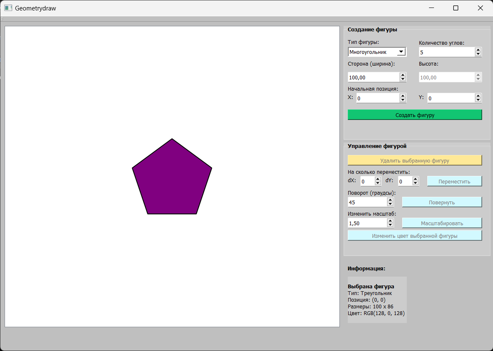

# Geometry Draw

Приложение для создания и редактирования геометрических фигур, разработанное на C++ с использованием Qt 5.14.2.

## Задание

Реализовать программу в виде оконного приложения, реализующего работу с геометрическими фигурами.
Фигуры - треугольник, прямоугольник, ромб, многоугольник (обеспечить возможность ввода многоугольника с N углами)
Функции - создание фигуры, удаление фигуры, перемещение, поворот, масштабирование, изменение цвета. 
Язык программирования - C++.
Разрешается использовать любые доступные фреймворки для построения оконных приложений на C++.
Запрещается использовать готовые библиотечные решения для работы с фигурами.

## Описание

Приложение представляет собой графический редактор для работы с геометрическими фигурами. Пользователь может создавать фигуры на холсте, управлять ими и просматривать информацию о выделенной фигуре.

### Возможности

- **Создание фигур**:
  - Треугольник
  - Прямоугольник
  - Ромб
  - Правильный многоугольник (от 3 до 99 сторон, т.е. приближение к кругу)

- **Операции с фигурами**:
  - Перемещение по холсту (кнопками или перетаскиванием мышью)
  - Поворот на заданный угол
  - Масштабирование
  - Изменение цвета
  - Удаление фигуры

- **Интерактивность**:
  - Перетаскивание фигуры с удержанием ЛКМ
  - Отображение информации о выделенной фигуре (тип, позиция, размеры, цвет)
  - Визуальное выделение выбранной фигуры красной рамкой кликом мыши

## Требования

- **Язык программирования**: C++17
- **Фреймворк**: Qt 5.14.2
- **Сборка**: CMake 3.16+

## Структура проекта


- `GeometryDraw/`
  - `CMakeLists.txt` - Файл конфигурации CMake
  - `CMakePresets.json` - Пресеты CMake
  - `CMakeUserPresets.json` - Пользовательские пресеты CMake
  - `Geometrydraw.qrc` - Ресурсы приложения
  - `Geometrydraw.ui` - Файл интерфейса (Qt Designer)
  - `README.md` - Документация проекта
  - `main.cpp` - Точка входа в приложение
  - `mainwindow.cpp` - Реализация логики приложения
  - `mainwindow.h` - Заголовочный файл главного окна
  - `.gitignore` - Игнорируемые файлы Git

  - `Geometry draw.sln` - Файл решения Visual Studio
  - `Geometry draw.vcxproj` - Проект Visual Studio
  - `Geometry draw.vcxproj.filters` - Фильтры проекта VS
  - `Geometry draw.vcxproj.user` - Пользовательские настройки VS

**Примечание**: Файлы `*.sln`, `*.vcxproj*` являются файлами Visual Studio и создаются автоматически при использовании данной IDE. Для сборки через CMake они не требуются.

## Архитектура приложения

Приложение построено на основе иерархии классов:


- `Figure` (абстрактный базовый класс)
  - `Triangle` - Треугольник
  - `Rectangle` - Прямоугольник
  - `Rhombus` - Ромб
  - `CustomPolygon` - Правильный многоугольник

Базовый класс `Figure` определяет общий интерфейс для всех фигур:
- `draw()` - отрисовка фигуры
- `move()` - перемещение
- `rotate()` - вращение (чисто виртуальный)
- `scale()` - масштабирование (чисто виртуальный)
- `contains()` - проверка попадания точки в фигуру
- `getBounds()` - получение габаритного прямоугольника

## Комментарии к реализации

1. Все фигуры хранятся в векторе `QVector<Figure*>`, что позволяет работать с ними полиморфно.

2. Перетаскивание фигур реализовано через установку `eventFilter` на `viewport` графического вида для отслеживания событий мыши.

3. Масштабирование фигур ограничено минимальными и максимальными размерами для сохранения корректного отображения:
   - Треугольник: размер от 10 до 200 пикселей
   - Прямоугольник: ширина и высота от 10 до 200 пикселей
   - Ромб: ширина и высота от 10 до 200 пикселей
   - Многоугольник: радиус от 10 до 150 пикселей

4. При выделении фигуры автоматически обновляется информационная панель с параметрами фигуры, а также активируются кнопки управления.

5. Снятие выделения с фигуры происходит по двойному щелчку ЛКМ по пустой области (для корректности работы `eventFilter`).

## Клонирование и сборка

### 1. Клонирование репозитория

```bash
git clone https://github.com/LextHot/GeometryDraw.git
cd GeometryDraw
```

### 2. Сборка проекта

```bash
mkdir build && cd build
cmake ..
cmake --build .
```

### 3. Запуск приложения

```bash
# Linux / macOS
./GeometryDraw

# Windows
Debug/GeometryDraw.exe
# или
Release/GeometryDraw.exe
```

## Интерфейс приложения

Основные элементы управления:

| Элемент | Назначение |
|---------|------------|
| Тип фигуры | Выбор типа создаваемой фигуры |
| X, Y | Координаты центра новой фигуры |
| Сторона (ширина) / Высота | Размерные параметры фигуры |
| Количество углов | Количество сторон (для многоугольника) |
| Создать фигуру | Создание фигуры на холсте |
| Удалить выбранную фигуру | Удаление выделенной фигуры |
| Переместить | Перемещение фигуры по осям X и Y |
| Повернуть | Поворот фигуры на угол (градусы) |
| Масштабировать | Масштабирование фигуры (коэффициент) |
| Изменить цвет выбранной фигуры | Изменение цвета выделенной фигуры |
| Информация | Отображение информации о выделенной фигуре |

<p align="center">
  
  <br>
  <em>Внешний вид приложения</em>
</p>
